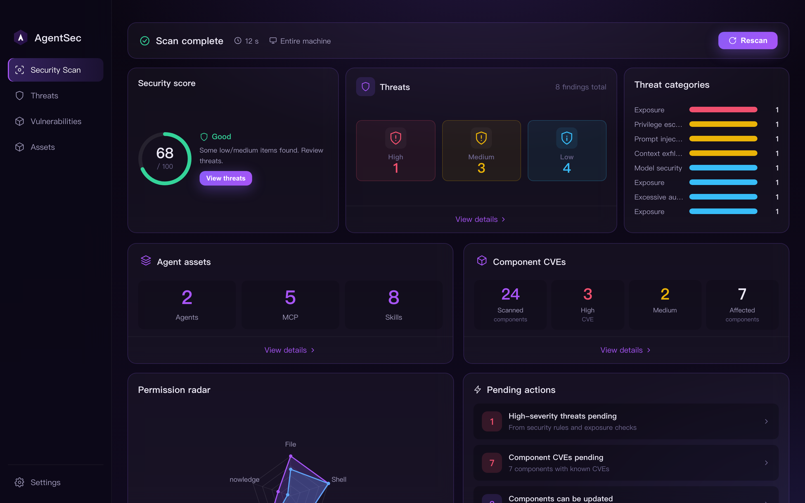
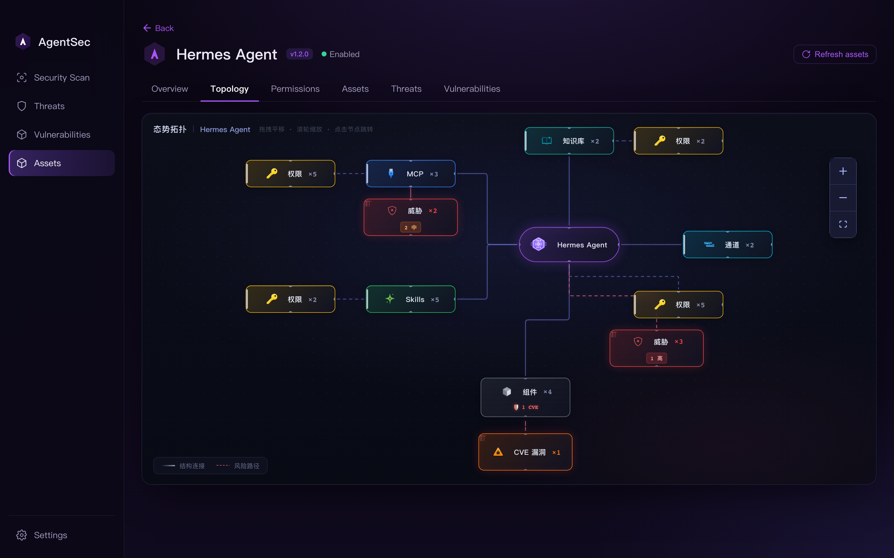

<h1 align="center">🛡️ AgentSec — Local Security Scanner for AI Agents</h1>

<p align="center">
  
</p>

<p align="center">
  <a href="LICENSE"></a>
  <a href="https://github.com/ChuhC/AgentSec"></a>
</p>

<p align="center"><strong>Language / 语言：</strong> <strong>English</strong> · <a href="README.zh-CN.md">简体中文</a></p>

> One-click local scans for your AI agents — exposure risks, dependency CVEs, and MCP / Skills assets. Everything stays on your device.

**Early preview** — Actively evolving; UI and APIs may change. Issues and PRs welcome.

AgentSec is a **macOS-first desktop security scanner** built for **Hermes** and **OpenClaw**. It does not replace your agents; it runs a local health check: surface misconfigurations and risky skills, match dependencies against known CVEs, and let you manage MCP servers, Skills, knowledge bases, and packages in one place — **no cloud, no telemetry, no account**.





---

## Platform support

| Platform | Status | Notes |
|----------|--------|-------|
| **macOS** | ✅ Primary | Day-to-day dev and `./scripts/package-dmg.sh` releases |
| **Windows** | 🧪 Experimental | `package-win.ps1` and path abstractions exist; **scanning not fully validated** — feedback welcome |

---

## Why AgentSec

| | Typical security tools | AgentSec |
|---|------------------------|----------|
| What it scans | Processes, containers | **Agent configs, Skills, MCP, dependencies** |
| Risk coverage | CVEs, ports | **Exposure + injection rules + CVE** in parallel |
| How you use it | CLI / server-side | **One-click desktop scan**, revisitable results |
| Your data | Often uploaded | **Stays on your device**, redacted snapshots only |

---

## Highlights

**Exposure detection** — pyATR rule packs plus OpenClaw security audit for agent-specific risks: baseline drift, prompt injection, tool-description poisoning, and context exfiltration. Findings aggregate by source and rule ID with severity tiers, evidence snippets, file locations, and ignore / path-whitelist workflows.

**Vulnerability management** — OSV-backed correlation between dependency versions and known CVEs, rolled up per component with CVSS, blast radius, and fix versions. Exposure and CVE pipelines are decoupled: a failed CVE feed does not block exposure results.

**Asset discovery & response** — Hermes / OpenClaw adapters inventory local MCP servers, skills, knowledge bases, and package dependencies per agent. Supports update, disable, and uninstall with configurable confirmation gates.

**Permission posture** — Normalizes declared permissions from agents and attached assets across file, shell, network, tool, and knowledge-base categories; a **permission matrix** compares capability coverage per component, and **radar charts** compare agents to spot over-privileged or risky capability mixes.

**Unified operations** — Fleet-wide security score, remediation queue, and per-agent workbench tie together threat review, CVE tracking, and asset ops. The **Situation topology** tab renders an interactive 2D graph of each agent's MCP, Skills, permissions, threats, components, and CVE links — click any node to jump to the filtered list.

**Local trust boundary** — Scan, persist, and render entirely on-device. Snapshots are redacted for credential-like fields before storage. No telemetry and no cloud account required.

---

## Quick start

### Install (recommended)

Download the latest release for your platform — **no Node.js or Python required**.

| Platform | Download | Notes |
|----------|----------|-------|
| **macOS** | [GitHub Releases](https://github.com/ChuhC/AgentSec/releases) → `AgentSec-*.dmg` | Open the DMG and drag **AgentSec** to Applications |
| **Windows** | Same page → `AgentSec Setup *.exe` | **Experimental** — scanning not fully validated |

> **macOS DMG builds are currently unsigned.** If Gatekeeper blocks the app, allow it under **System Settings → Privacy & Security**, or right-click the app → **Open**.

After install, launch AgentSec and run a scan from the home screen. Results and preferences are stored locally (macOS: `~/Library/Application Support/AgentSec/`). Language, theme, CVE lookup, and other options are in the in-app **Settings** page.

### Development (from source)

For contributors or testing unreleased changes. Requires **Node.js ≥ 18** and **Python ≥ 3.10**.

AgentSec is **two parts**: `engine/` is the Python scan backend; `app/` is the Electron desktop shell. In dev mode the shell spawns the engine from `engine/.venv`.

Run commands from the **repository root**.

#### macOS

> macOS ships with `python3` **3.8**, which is too old. Do **not** run `python3 -m venv` inside `engine/` if you already have an `engine/.venv` built with 3.11 — that triggers `ensurepip` errors.

```bash
./scripts/setup-engine.sh   # once: Python venv + engine deps
./scripts/run-dev.sh        # Electron dev (hot reload)
```

If `engine/.venv` already exists with Python 3.10+, skip straight to `./scripts/run-dev.sh`.

Slow Electron downloads:

```bash
export ELECTRON_MIRROR="https://npmmirror.com/mirrors/electron/"
```

#### Windows (experimental)

Scanning and packaging on Windows are **not fully validated** — feedback welcome via Issues.

In **PowerShell** (Python 3.10+ on `PATH`; use `py -3.11` if `python` points to an older version):

```powershell
cd engine
python -m venv .venv    # remove .venv first if recreate fails
.\.venv\Scripts\Activate.ps1
pip install -e .
cd ..\app
npm install
npm run dev
```

Discovery defaults to `%USERPROFILE%\.hermes` and `%USERPROFILE%\.openclaw`. Report Issues if paths or behavior differ from macOS.

Slow Electron downloads:

```powershell
$env:ELECTRON_MIRROR = "https://npmmirror.com/mirrors/electron/"
```

#### Building releases

The **PyInstaller-frozen Python engine must be built on the target OS** (you cannot produce a runnable Windows `.exe` engine from macOS alone). Package the Electron shell on each platform separately; use the repo scripts below.

**macOS (DMG)** — on macOS:

```bash
./scripts/package-dmg.sh
```

| Flag | Purpose |
|------|---------|
| `--skip-engine` | Skip PyInstaller (faster when the engine unchanged) |
| `--skip-npm-install` | Skip `npm install` |

Output: `app/release/AgentSec-*.dmg` · icon: `app/build/icon.icns`

**Windows (NSIS · experimental)** — PowerShell from the repo root on Windows:

```powershell
.\scripts\package-win.ps1
```

| Flag | Purpose |
|------|---------|
| `-SkipEngine` | Skip PyInstaller |
| `-SkipNpmInstall` | Skip `npm install` |

Output: `app/release/AgentSec Setup *.exe` (`app/build/icon.ico` is not shipped yet; falls back to the electron-builder default icon)

**Manual steps** (from `app/`):

```bash
npm run build:engine   # runs ../scripts/build-engine.cjs on the current OS
npm run build          # TypeScript + Vite + Electron main
npm run dist:mac       # electron-builder → dmg
npm run dist:win       # electron-builder → NSIS (run on Windows)
```

Mirror for electron-builder binaries (optional):  
`ELECTRON_BUILDER_BINARIES_MIRROR="https://npmmirror.com/mirrors/electron-builder-binaries/"`

---

## Third-party components

| Component | Role | Notes |
|-----------|------|-------|
| [pyATR](https://pypi.org/project/pyatr/) | Exposure rules | Bundled ATR rule packs, offline matching |
| [OSV](https://osv.dev/) | CVE lookup | Network query for dependency CVEs (graceful degradation) |
| [cvss](https://pypi.org/project/cvss/) | CVSS parsing | Severity display |
| OpenClaw security audit rules | Exposure supplement | Parallel to pyATR; see `engine/agentsec_engine/detectors/` |

UI stack: Electron · React · Vite · TypeScript.

---

## Contributing & license

Issues and PRs welcome. Before UI changes: `cd app && npx tsc --noEmit`

Copyright © 2026 [ChuhC](https://github.com/ChuhC). Licensed under [AGPL-3.0](LICENSE). Network-deployed modifications must offer corresponding source to users.

Report security issues via [SECURITY.md](SECURITY.md) and GitHub Security Advisories — do not file public Issues for exploitable vulnerabilities.
