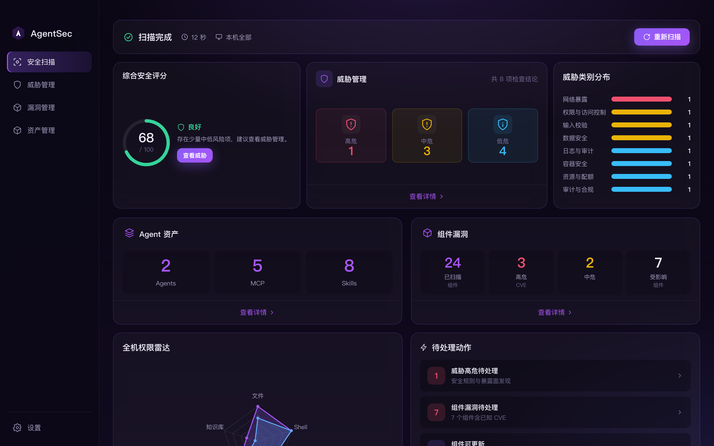

# AgentSec

[](LICENSE)

**Languages / 语言：** [English](README.en.md) · **简体中文**

> 一键摸清本机 AI Agent 的安全底数 — 暴露面、组件 CVE、MCP / Skills 资产，全部在本地完成。

AgentSec 是面向 macOS 的桌面安全工具，专为 **Hermes** 与 **OpenClaw** 设计。它不替代你的 Agent，而是在旁边做一轮「体检」：扫配置与技能里的风险、查依赖里的已知漏洞，并让你在同一界面里管理 MCP、Skills、知识库与组件 — **数据不出本机，无遥测，无账号**。



---

## 为什么用 AgentSec

| | 传统安全工具 | AgentSec |
|---|-------------|----------|
| 扫描对象 | 通用进程 / 容器 | **Agent 配置、Skill、MCP、依赖** |
| 风险类型 | CVE、端口 | **暴露面 + Prompt 注入规则 + CVE** 双管线 |
| 使用方式 | CLI / 服务端 | **桌面一键扫描**，结果可反复查看 |
| 数据 | 常需上报 | **纯本地**，快照脱敏后仅存本机 |

---

## 核心能力

**暴露面检测** — 集成 pyATR 规则库与 OpenClaw 安全审计，覆盖配置基线偏差、Prompt 注入、工具描述投毒、上下文外泄等 Agent 特有风险；发现项按来源与规则聚合，附带严重度分级、证据片段与文件定位，支持误报忽略与路径白名单。

**组件漏洞治理** — 基于 OSV 对 Agent 依赖做版本—CVE 关联，按组件聚合展示 CVSS、影响范围与修复版本；暴露面与 CVE 双管线解耦，CVE 数据源不可达时不阻断暴露面扫描结论。

**资产发现与处置** — 通过 Hermes / OpenClaw 适配器解析本机 MCP、Skill、知识库及包管理依赖，形成按 Agent 分组的资产清单；支持组件更新、禁用与卸载，关键操作可配置二次确认。

**权限态势评估** — 汇总 Agent 与挂载资产的权限声明，按文件、Shell、网络、工具、知识库等维度归一化，以雷达图对比多 Agent 权限暴露面，辅助识别高危能力组合。

**统一运营视图** — 全机安全评分、待处置项队列与分 Agent 工作台联动；在同一应用内完成威胁研判、漏洞跟踪与资产运维，无需在扫描器与配置工具之间切换。

**本地可信执行** — 扫描、存储与展示均在设备侧完成；快照落盘前对凭证类字段脱敏，不采集遥测、不依赖云端账号。

---

## 快速开始

环境：macOS · Node.js ≥ 18 · Python ≥ 3.10

```bash
cd engine && python3 -m venv .venv && source .venv/bin/activate && pip install -e .
cd ../app && npm install && npm run dev
```

Electron 下载慢时可设：`ELECTRON_MIRROR="https://npmmirror.com/mirrors/electron/"`

---

## 打包发布

**PyInstaller 冻结的 Python 引擎必须在目标操作系统上构建**（无法在 Mac 上直接产出可在 Windows 运行的 `.exe`）。Electron 前端可在各平台分别打包；推荐用仓库内一键脚本。

### macOS（DMG）

在 macOS 上执行：

```bash
./scripts/package-dmg.sh
```

| 参数 | 说明 |
|------|------|
| `--skip-engine` | 跳过 PyInstaller（引擎未改时可加速） |
| `--skip-npm-install` | 跳过 `npm install` |

产物：`app/release/AgentSec-*.dmg`  
可选图标：`app/build/icon.icns`

### Windows（NSIS 安装包）

在 Windows 上打开 PowerShell（项目根目录）：

```powershell
.\scripts\package-win.ps1
```

| 参数 | 说明 |
|------|------|
| `-SkipEngine` | 跳过 PyInstaller |
| `-SkipNpmInstall` | 跳过 `npm install` |

产物：`app/release/AgentSec Setup *.exe`  
可选图标：`app/build/icon.ico`

### 手动分步（`app/` 目录）

```bash
npm run build:engine   # 调用 ../scripts/build-engine.cjs，须在对应 OS 上执行
npm run build          # TypeScript + Vite + Electron 主进程
npm run dist:mac       # electron-builder → dmg
npm run dist:win       # electron-builder → NSIS（在 Windows 上执行）
```

国内网络可设：`ELECTRON_BUILDER_BINARIES_MIRROR="https://npmmirror.com/mirrors/electron-builder-binaries/"`

---

## 配置

| 环境变量 | 说明 |
|----------|------|
| `AGENTSEC_DATA_DIR` | 数据目录（覆盖平台默认；打包态由 Electron 传入 `userData`） |
| `AGENTSEC_ENGINE_DIR` | 开发态引擎源码目录（默认 `app/../engine`） |
| `AGENTSEC_PYTHON` | 开发态 Python 解释器（默认 `engine/.venv` 内解释器） |
| `AGENTSEC_DEBUG` | `1` 开启调试日志 |

默认数据目录（未设置 `AGENTSEC_DATA_DIR` 时）：

| 平台 | 路径 |
|------|------|
| macOS | `~/Library/Application Support/AgentSec/` |
| Windows | `%APPDATA%\AgentSec\` |

更多设计说明见 [`docs/`](docs/)。

---

## 参与与许可

欢迎 Issue / PR。UI 改动前建议：`cd app && npx tsc --noEmit`

个人开发者作品，采用 [AGPL-3.0](LICENSE)。修改后若作为网络服务提供，须向用户公开对应源代码。

安全问题请通过 GitHub Security Advisories 反馈。
