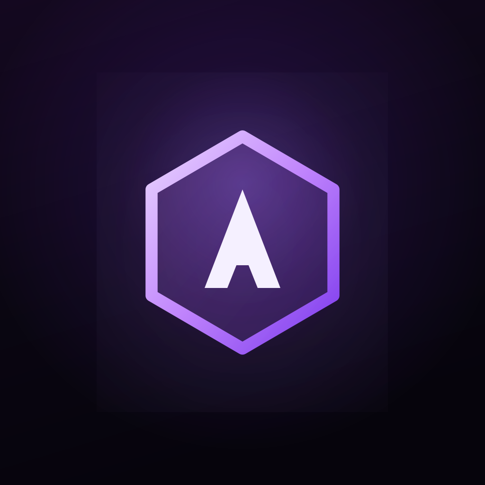

<h1 align="center">🛡️ AgentSec — 本机 AI Agent 安全扫描器</h1>

<p align="center">
  
</p>

<p align="center">
  <a href="LICENSE"></a>
  <a href="https://github.com/ChuhC/AgentSec/releases"></a>
  <a href="https://github.com/ChuhC/AgentSec"></a>
</p>

<p align="center"><strong>Language / 语言：</strong> <a href="README.md">English</a> · <strong>简体中文</strong></p>

> 一键扫描本机 AI Agent：暴露面、组件 CVE、MCP / Skills 资产。

**v0.1 早期预览** — 功能仍在快速迭代，界面与接口可能调整。欢迎 Issue / PR 反馈与共建。

AgentSec 是以 **macOS 为主平台** 的桌面安全工具，专为 **Hermes** 与 **OpenClaw** 设计。它不替代你的 Agent，而是在旁边做一轮「体检」：扫配置与技能里的风险、查依赖里的已知漏洞，并让你在同一界面里管理 MCP、Skills、知识库与组件 — **数据不出本机，无遥测，无账号**。


---

## 平台支持

| 平台 | 状态 | 说明 |
|------|------|------|
| **macOS** | ✅ 主要支持 | 日常开发与 `./scripts/package-dmg.sh` 发布 |
| **Windows** | 🧪 实验性 | 提供 `package-win.ps1` 与路径抽象；扫描与适配**尚未完整验证**，欢迎实测反馈 |

---

## 为什么用 AgentSec

| | 传统安全工具 | AgentSec |
|---|-------------|----------|
| 扫描对象 | 通用进程 / 容器 | **Agent 配置、Skill、MCP、依赖** |
| 风险类型 | CVE、端口 | **暴露面 + Prompt 注入规则 + CVE** 双管线 |
| 使用方式 | CLI / 服务端 | **桌面一键扫描**，结果可反复查看 |
| 数据 | 常需上报 | **纯本地**，快照脱敏后仅存本机 |

---

## 核心能力

**暴露面检测** — 集成 pyATR 规则库与 OpenClaw 安全审计，覆盖配置基线偏差、Prompt 注入、工具描述投毒、上下文外泄等 Agent 特有风险；发现项按来源与规则聚合，附带严重度分级、证据片段与文件定位，支持误报忽略与路径白名单。

**组件漏洞治理** — 基于 OSV 对 Agent 依赖做版本—CVE 关联，按组件聚合展示 CVSS、影响范围与修复版本；暴露面与 CVE 双管线解耦，CVE 数据源不可达时不阻断暴露面扫描结论。

**资产发现与处置** — 通过 Hermes / OpenClaw 适配器解析本机 MCP、Skill、知识库及包管理依赖，形成按 Agent 分组的资产清单；支持组件更新、禁用与卸载，关键操作可配置二次确认。

**权限态势评估** — 汇总 Agent 与挂载资产的权限声明，按文件、Shell、网络、工具、知识库等维度归一化；**权限矩阵**对比各组件能力覆盖，**雷达图**对比多 Agent 权限暴露面，辅助识别高危能力组合。

**统一运营视图** — 全机安全评分、待处置项队列与分 Agent 工作台联动；在同一应用内完成威胁研判、漏洞跟踪与资产运维，无需在扫描器与配置工具之间切换。

**本地可信执行** — 扫描、存储与展示均在设备侧完成；快照落盘前对凭证类字段脱敏，不采集遥测、不依赖云端账号。

---

## 快速开始

### 安装使用（推荐）

从 [GitHub Releases](https://github.com/ChuhC/AgentSec/releases) 下载对应平台的安装包 — **无需安装 Node.js 或 Python**。

| 平台 | 下载 | 说明 |
|------|------|------|
| **macOS** | `AgentSec-*.dmg` | 打开 DMG，将 **AgentSec** 拖入「应用程序」 |
| **Windows** | `AgentSec Setup *.exe` | **实验性** — 扫描能力尚未完整验证 |

> **macOS DMG 当前未做 Apple 代码签名。** 首次打开若被 Gatekeeper 拦截，请在「系统设置 → 隐私与安全性」中允许，或右键 App → **打开**。

安装后启动 AgentSec，在首页发起扫描即可。扫描结果与偏好设置保存在本机（macOS：`~/Library/Application Support/AgentSec/`）；语言、主题、CVE 联网等可在应用内 **设置** 中调整。

### 从源码开发

面向贡献者或需要测试未发布版本的情况。需要 **Node.js ≥ 18** 与 **Python ≥ 3.10**。

AgentSec 是**两部分**：`engine/` 为 Python 扫描引擎；`app/` 为 Electron 桌面壳。开发模式下壳进程会自动拉起 `engine/.venv` 里的引擎。

以下命令均在**仓库根目录**执行。

#### macOS

> macOS 自带的 `python3` 是 **3.8**，版本不够。若 `engine/.venv` 已用 3.11 建好，再执行 `python3 -m venv .venv` 会报 `ensurepip` 错误。

```bash
./scripts/setup-engine.sh   # 一次性：创建 engine/.venv 并安装依赖
./scripts/run-dev.sh        # 启动 Electron 开发模式（热更新）
```

若已有可用的 `engine/.venv`（Python 3.10+），直接 `./scripts/run-dev.sh` 即可。

Electron 下载慢时可设：

```bash
export ELECTRON_MIRROR="https://npmmirror.com/mirrors/electron/"
```

#### Windows（实验性）

Windows 上的扫描与打包**尚未完整验证**，欢迎通过 Issue 反馈。

在 **PowerShell** 中（需 Python 3.10+ 在 `PATH` 中；若 `python` 版本过旧，可改用 `py -3.11`）：

```powershell
cd engine
python -m venv .venv    # 若重建失败，请先删除 .venv
.\.venv\Scripts\Activate.ps1
pip install -e .
cd ..\app
npm install
npm run dev
```

Hermes / OpenClaw 默认从 `%USERPROFILE%\.hermes` / `%USERPROFILE%\.openclaw` 发现；若路径或行为与 macOS 不一致，请提 Issue。

Electron 下载慢时可设：

```powershell
$env:ELECTRON_MIRROR = "https://npmmirror.com/mirrors/electron/"
```

#### 打包发布

**PyInstaller 冻结的 Python 引擎必须在目标操作系统上构建**（无法在 Mac 上直接产出可在 Windows 运行的 `.exe`）。Electron 前端可在各平台分别打包；推荐用仓库内一键脚本。

**macOS（DMG）** — 在 macOS 上执行：

```bash
./scripts/package-dmg.sh
```

| 参数 | 说明 |
|------|------|
| `--skip-engine` | 跳过 PyInstaller（引擎未改时可加速） |
| `--skip-npm-install` | 跳过 `npm install` |

产物：`app/release/AgentSec-*.dmg` · 图标：`app/build/icon.icns`

**Windows（NSIS · 实验性）** — 在 Windows PowerShell（项目根目录）：

```powershell
.\scripts\package-win.ps1
```

| 参数 | 说明 |
|------|------|
| `-SkipEngine` | 跳过 PyInstaller |
| `-SkipNpmInstall` | 跳过 `npm install` |

产物：`app/release/AgentSec Setup *.exe`（`app/build/icon.ico` 尚未随仓库提供，将使用 electron-builder 默认图标）

**手动分步**（在 `app/` 目录）：

```bash
npm run build:engine   # 调用 ../scripts/build-engine.cjs，须在对应 OS 上执行
npm run build          # TypeScript + Vite + Electron 主进程
npm run dist:mac       # electron-builder → dmg
npm run dist:win       # electron-builder → NSIS（在 Windows 上执行）
```

国内网络可设：`ELECTRON_BUILDER_BINARIES_MIRROR="https://npmmirror.com/mirrors/electron-builder-binaries/"`

---

## 第三方组件

| 组件 | 用途 | 说明 |
|------|------|------|
| [pyATR](https://pypi.org/project/pyatr/) | 暴露面规则检测 | 内置 ATR 规则包，离线匹配 |
| [OSV](https://osv.dev/) | CVE 查询 | 联网查询依赖漏洞（可失败降级） |
| [cvss](https://pypi.org/project/cvss/) | CVSS 解析 | 评分展示 |
| OpenClaw 安全审计规则 | 暴露面补充 | 与 pyATR 并行，见 `engine/agentsec_engine/detectors/` |

UI 栈：Electron · React · Vite · TypeScript。

---

## 参与与许可

欢迎 Issue / PR。UI 改动前建议：`cd app && npx tsc --noEmit`

Copyright © 2026 [ChuhC](https://github.com/ChuhC). 本项目采用 [AGPL-3.0](LICENSE) 许可。若你将修改版作为网络服务提供，须向用户提供对应源代码。

安全问题请阅读 [SECURITY.md](SECURITY.md)，通过 GitHub Security Advisories 私下反馈，勿公开 Issue 披露可利用漏洞。