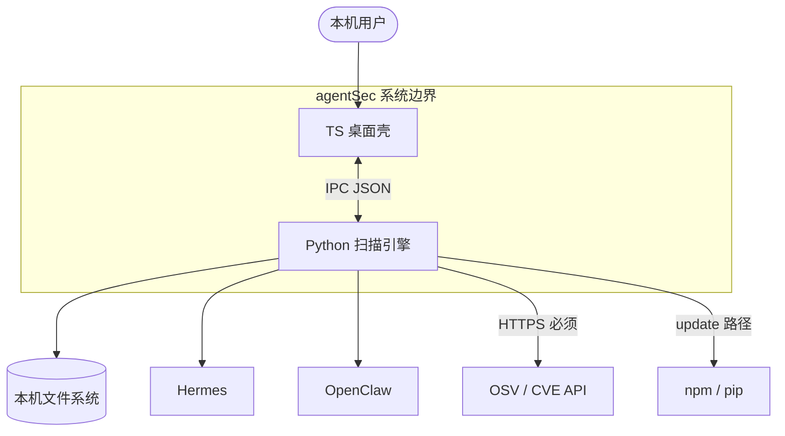
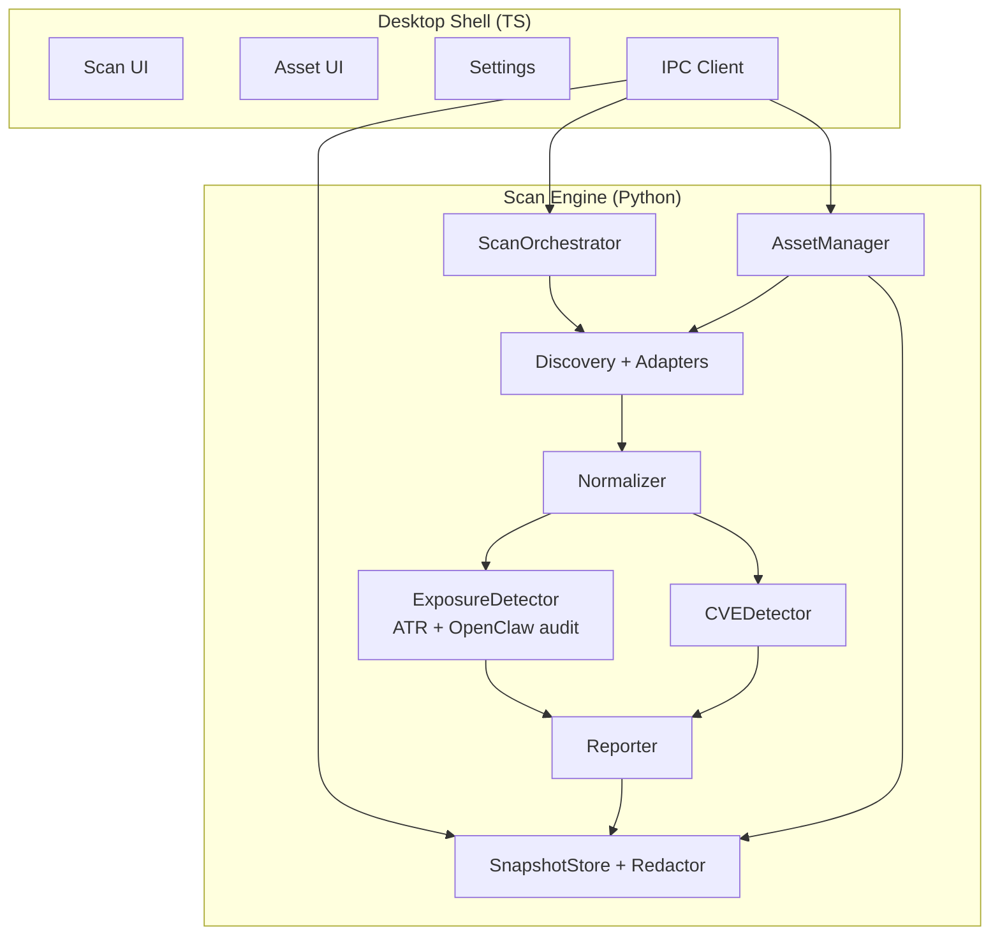
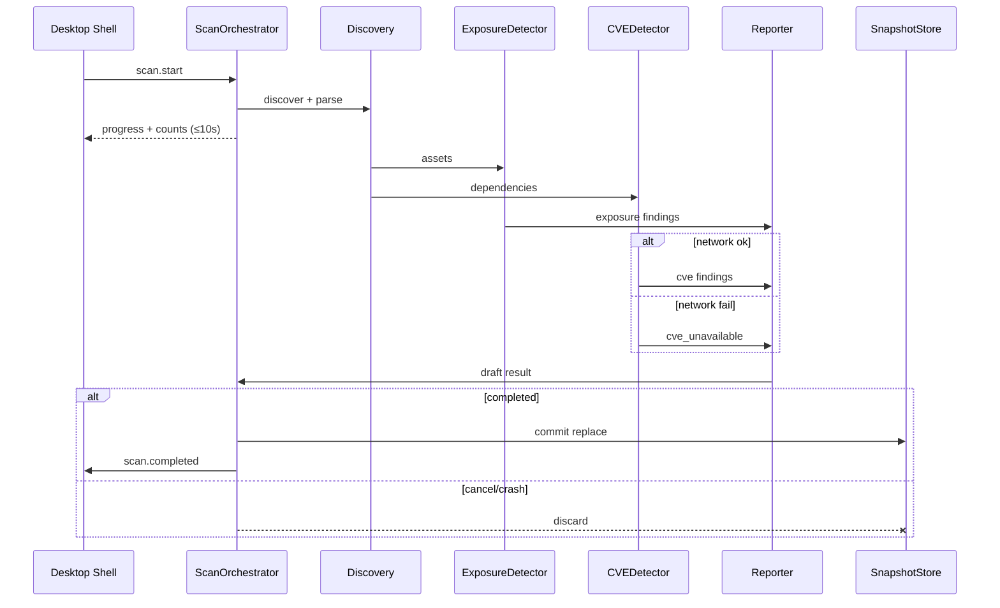
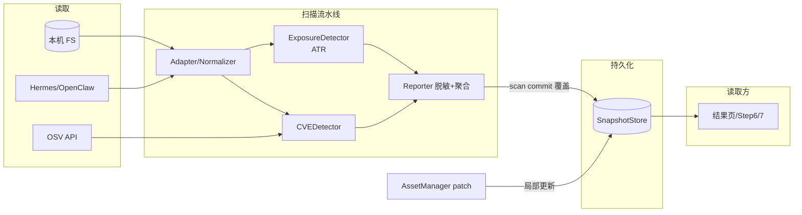
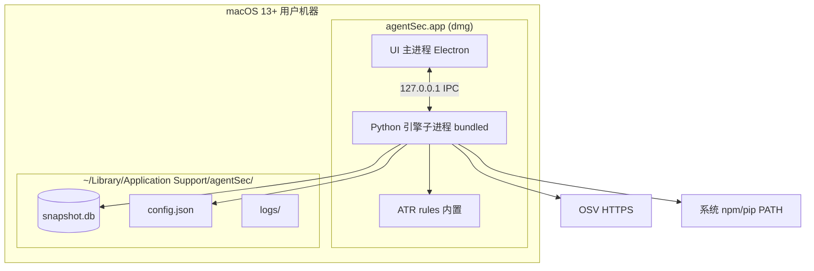

# agentSec 架构设计文档

> 规范版本：v1.0 Standard  
> 文档作者：ArchMaster 共识落盘  
> 评审状态：已通过（2026-06 修订：暴露面引擎改为 ATR）  
> 依据：[`docs/requirements/requirements.md`](../requirements/requirements.md)、[`docs/design/prd-sketch.md`](../design/prd-sketch.md)

---

## 一、架构目标与系统定级

### 1. 功能目标

- **安全扫描**：本机 Hermes / OpenClaw 一键扫描；暴露面/基线 + Prompt Injection 规则检测；组件 CVE（联网 OSV）。
- **资产管理**：Step6/7 查看 MCP/Skills/知识库/依赖；更新/禁用/卸载；权限雷达与弹窗聚合。
- **桌面交付**：macOS dmg；暗紫毛玻璃 UI；设置与确认策略内置。

### 2. 非功能目标

| 属性 | 目标 |
|------|------|
| **性能** | 单 Agent ≤1min；`--all` ≤2min；10s 内进度+资产计数 |
| **可用性** | 扫描未完成不 commit；保留上次完整快照；写失败弹框 |
| **安全性** | 纯本地；落盘脱敏；无遥测/导出 |
| **存储** | 仅最近一次快照；重启可读；总量 ≤300MB |
| **团队** | 1 人；Python 引擎 + TS 桌面壳 |

### 3. 系统复杂度定级

- **当前定级：L2**
- **定级依据**：本机双进程桌面应用 + 模块化单体 Python 引擎 + 2 个 Adapter；无服务端、无多租户。

---

## 二、业务建模

### 1. 核心用例

| 用例 | 参与者 | 说明 |
|------|--------|------|
| UC-1 一键扫描 | 用户 | 默认全量或自定义路径 |
| UC-2 查看风险/CVE | 用户 | 双 KPI 详情左右分栏 |
| UC-3 浏览资产 | 用户 | Step6→Step7，读快照 |
| UC-4 管理组件 | 用户 | 更新/禁用/卸载 + 确认 |
| UC-5 查看权限 | 用户 | 雷达 + 弹窗 + 定位来源 |

### 2. 核心业务流程

见第三节 **核心流程图**。

### 3. 核心领域对象

| 对象 | 说明 |
|------|------|
| `Agent` | Hermes / OpenClaw 实例 |
| `Asset` | MCP / Skill / 知识库 / 依赖 |
| `PermissionEntry` | 权限条目（含来源类型） |
| `ExposureFinding` | 暴露面/基线/Prompt 注入发现 |
| `CVEFinding` | 组件 CVE 匹配结果 |
| `ScanSnapshot` | 最近一次完整扫描快照（脱敏后） |
| `ScanMeta` | 时间、路径、耗时、`cve_status` |

---

## 三、架构视图设计

> 五张 EA 视图以 Mermaid 交付；`images/*.png` 待从本节导出替换。

### 1. 系统上下文图



*图注：唯一上游为用户；下游含 Agent 产品、文件系统、CVE API、包管理器；无云服务/App Store/遥测。*

### 2. 模块划分图



*图注：模块化单体；ExposureDetector 以 **ATR（pyATR）** 为主；双 Detector 分离；Reporter 统一输出。*

#### ExposureDetector 组成（ADR 修订）

```text
ExposureDetector
  ├─ ATREngine（pyATR）          # MVP 主规则源；本地 rules/；pattern 类规则
  ├─ OpenClawAuditCollector      # wrap `openclaw security audit --json`
  └─（vNext）agentsec 扩展 YAML   # Hermes/OpenClaw 专有少量规则
```

| 扫描对象 | 引擎 |
|----------|------|
| Skill 目录、SKILL.md、MCP JSON、Agent 配置片段 | ATR `evaluate` / `scan` |
| OpenClaw gateway/FS/权限基线 | OpenClaw 官方 audit |
| 组件依赖 CVE | **不在此模块** → CVEDetector |

### 3. 核心流程图



*图注：异步 progress；完成才 commit；取消/崩溃丢弃本次。*

### 4. 核心数据流图



*图注：SnapshotStore 为唯一读源；写路径仅 scan commit 与 asset patch；Finding 不随 patch 更新。*

### 5. 物理部署视图



*图注：无入站网络；Python 打包进 app；npm/pip 不 bundling。*

---

## 四、数据设计

### 1. 存储策略

| 数据 | 位置 | 策略 |
|------|------|------|
| `ScanSnapshot` | `snapshot.db`（或 JSON） | 仅最近一次；扫描 **replace**；Reporter 脱敏后写入 |
| `AppConfig` | `config.json` | 设置、确认策略 |
| 日志 | `logs/` | 阶段/错误码；无扫描明细 |

### 2. 缓存策略

| 项 | MVP | vNext |
|----|-----|-------|
| OSV 响应 | 可选内存/短期缓存（同次扫描 dedupe） | — |
| CVE 本地库 | **不做** | `cve/` 目录 + `LocalCVEStore` Provider |
| npm 缓存 | **不管理** | 不管理 |
| ATR rules | **内置子集**（`pattern` + skill/mcp/config）随 dmg | 可选在线更新 rule pack |

### 3. Asset patch 语义（B3-b）

写操作成功后 `AssetManager` 对快照 **局部 patch**：`version`、`status`、相关 `PermissionEntry`、统计字段；**不**更新 `ExposureFinding` / `CVEFinding`。

---

## 五、非功能设计

### 1. 性能设计

- Discovery 与双 Detector 顺序/有限并行；Adapter 级失败不阻塞其他 Agent。
- UI 与引擎 IPC 异步；progress 事件驱动。
- 10s 内推送阶段 + 资产计数，不推 partial Finding。

### 2. 安全性设计

- IPC 仅 localhost；引擎不监听 LAN。
- Reporter 落盘脱敏；凭证类仅存类型+位置。
- 无出站除 OSV（及将来 CVE 库同步）；**暴露面 ATR 扫描纯离线**。

### 3. 可观测性设计

- 引擎结构化日志：阶段、错误码、Adapter 名。
- MVP 无遥测；可选本地 debug 模式（设置中关闭默认）。

### 4. 可维护性与代码规范

- Adapter 插件边界：`HermesAdapter` / `OpenClawAdapter` 实现统一端口。
- **ExposureDetector**：`pyatr.ATREngine` + 内置 `rules/`；MVP 仅启用 `detection_tier: pattern` 且目标为 skill / mcp_config / agent_config 的规则子集。
- `CVEDetector` Provider 接口：`RemoteOSVProvider`（MVP，pip-audit/OSV）、`LocalCVEStore`（vNext 占位）。
- Python 包结构按模块目录划分，与模块图一致。

---

## 六、风险登记与演进规划

### 1. 全局架构风险登记表

| 风险编号 | 风险描述 | 触发条件 | 缓解方案 |
| :--- | :--- | :--- | :--- |
| **R-01** | Adapter 配置格式变更 | Agent 升级 | 版本化 Adapter；解析失败 → 部分 Finding |
| **R-02** | npm/pip 不可用或失败 | 用户未装 Node/Python | 更新灰显/弹框；不 patch 快照 |
| **R-03** | CVE 无网不可用 | 离线环境 | UI 明确提示；暴露面仍可用 |
| **R-04** | patch 与 Finding 不一致 | 写后未重扫 | UI 提示「风险结论来自上次扫描」 |
| **R-05** | Electron 体积/内存 | 低配 Mac | 接受；Growth 可评估 Tauri 迁移 |
| **R-06** | ATR behavioral/protocol 规则无运行时数据 | 仅静态扫配置 | MVP 只启用 pattern 子集；OpenClaw audit 补基线 |

### 2. 架构演进路线

- **MVP**：双进程 dmg；**ATR 暴露面** + Remote OSV；Snapshot replace + asset patch；2 Adapter。
- **Growth**：本地 CVE 库/缓存（离线降级）；Windows 壳；更多 Adapter（Cursor 等）。
- **Scale**：CI 插件、可选导出报告（若需求变更）。

---

## 附录 C：ATR 集成要点（ExposureDetector）

### 依赖

- Python：`pyatr`（[Agent-Threat-Rule/agent-threat-rules](https://github.com/Agent-Threat-Rule/agent-threat-rules)）
- 规则：`rules/` **子集内置**于 dmg（扫描时不访问 npm）

### 调用形态

```python
from pyatr import ATREngine, AgentEvent

engine = ATREngine(rules_dir= bundled_rules_path)
engine.load_rules_from_directory(bundled_rules_path)

# 对每个 Discovery 产出的可扫文件
matches = engine.evaluate(AgentEvent(
    content=file_text,
    event_type="skill_md",  # 或 mcp_config / agent_config
    path=file_path,
))
# → Reporter.map_atr(rule_id, severity, location, owasp_agentic)
```

### MVP 规则筛选原则

| 启用 | 跳过 |
|------|------|
| `detection_tier: pattern` | `behavioral` / `protocol`（需运行时日志） |
| 目标：skill、mcp_config、agent_config | 需 LLM I/O 实时流的规则 |
| `status: stable`（或经测试的 experimental） | 与 OpenClaw audit 完全重复的 check |

### Reporter 映射

| ATR | agentSec |
|-----|----------|
| `ATR-YYYY-NNNNN` | `ExposureFinding.id`（保留原 ID） |
| `critical/high/medium/low` | 高/中/低（UI 三档） |
| `references.owasp_agentic` | Finding.category 标签 |
| 文件路径 + 行号 | 定位来源 → Step7 Tab |

### 与 OpenClaw 分工

- **ATR**：Skill 内容、MCP JSON、通用 Agent 配置文本
- **`openclaw security audit --json`**：OpenClaw 专有 checkId（FS 权限、gateway 暴露等）
- 两者 Finding 均进 Reporter，**去重键**：`(source, check_id, path, line)`

**MVP 规则子集（10 类 × ~5 条，共 ~45–60 条）**：见 [`docs/engine/atr-mvp-rules.md`](../engine/atr-mvp-rules.md)。

---

## 附录 A：架构视图逻辑底稿

见 Phase 2 Step A～B5 讨论记录（已同步至 `requirements.md` 第九节）。

---

## 附录 B：技术选型与架构决策记录（ADR）

| 决策领域 | 选型方案 | Gain | Sacrifice | Conclusion |
| :--- | :--- | :--- | :--- | :--- |
| **扫描引擎语言** | Python | 规则/SCA 生态；1 人效率 | 需打包运行时 | ✅ 已确认 |
| **桌面 UI 栈** | **Electron + React/Vite + TS** | UI 还原快；sidecar 成熟 | 体积/内存较大 | ✅ 已确认（放弃 Tauri：1 人 sidecar 集成风险） |
| **IPC** | localhost JSON（stdio/socket） | 简单安全 | 本机 only | ✅ 倾向 Unix socket |
| **快照存储** | SQLite | 结构化查询；单文件 | 需 schema 迁移 | ✅ MVP 倾向 |
| **CVE MVP** | Remote OSV | 实现快；无库维护 | 无网不可用 | ✅ 已确认 |
| **CVE vNext** | LocalCVEStore | 离线可用 | 库体积与更新 | 📋 已规划 |
| **暴露面规则引擎** | **ATR（pyATR）+ 内置 rules 子集** | 离线；OWASP 映射；规则可扩展 | Skill AST/YARA 弱于 SkillSpector | ✅ 已确认（2026-06 修订；放弃 SkillSpector） |
| **进程模型** | UI + 1 Python 引擎 | 运维简单 | 引擎 crash 需重启 | ✅ 已确认 |
