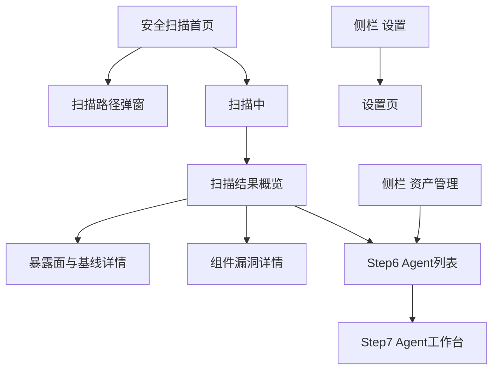

# agentSec 桌面客户端 PRD（定稿草案）

> 版本：MVP 桌面版  
> 设计准绳：[`ui-flow/desktop-macos/DESIGN-SHELL.md`](./ui-flow/desktop-macos/DESIGN-SHELL.md)  
> 目标用户：普通本机用户，有基本动手能力，但不预设安全研究背景。

## 1. 产品定位

agentSec 是一款面向本机 Agent 使用者的桌面安全工具，用于一键检查本机 Agent 的安全配置、暴露面、组件漏洞，并管理 Agent 相关 MCP、Skills、知识库和依赖组件。

一句话价值：

> 一键检查 Agent 安全风险。

## 2. 目标用户

| 用户 | 特征 | 核心诉求 |
|------|------|----------|
| 普通 Agent 用户 | 使用 Hermes / OpenClaw 等本机 Agent 工具 | 不知道本机 Agent 是否安全 |
| 有一定动手能力的个人用户 | 能理解安装、更新、禁用、卸载 | 想知道装了哪些 MCP / Skills，是否还能删 |
| 小团队成员 | 使用统一或相似 Agent 配置 | 希望快速定位高风险配置和过期组件 |

MVP 不以安全研究员、企业安全平台管理员为主要用户。

## 3. MVP 范围

### 3.1 必做

| 模块 | 能力 | 说明 |
|------|------|------|
| 安全扫描 | 一键扫描 | 默认扫描全部范围，不让用户选择扫描类型 |
| 安全扫描 | 自定义扫描路径 | 首页隐藏入口，点击后弹窗选择本机全部 / 自定义路径 |
| 暴露面与基线 | 风险检测 | 输出高 / 中 / 低，包含配置、权限、Prompt 注入面等 |
| 组件漏洞 | CVE 检测 | 输出组件名、威胁级别、CVE 数、版本与升级建议 |
| Agent 资产发现 | 识别 Agent | 识别 Hermes / OpenClaw 及其 MCP、Skills、知识库、依赖 |
| 资产管理 | 统计与筛选 | 按 Agent、类型、名称过滤资产 |
| 资产管理 | 组件详情 | 查看 MCP / Skill 的用途、来源、权限、状态 |
| 资产管理 | 管理操作 | 更新、禁用、卸载，危险操作需要确认 |
| 设置 | 内部设置页 | 语言、主题、扫描、资产管理确认策略 |

### 3.2 暂不做

| 能力 | 说明 |
|------|------|
| 攻击路径图谱推理 | MVP 不做多步攻击链可视化 |
| 自动修复 | 不自动改配置；资产管理操作需用户明确触发 |
| 定时后台扫描 | 不做计划任务和常驻守护 |
| 扫描历史 / Diff | MVP 不做历史对比 |
| 企业多租户 | 不做团队集中管控 |
| 高危行为告警 | vNext 占位，MVP 不实现实时行为监控 |

## 4. 信息架构

侧栏固定三项：

```text
安全扫描
资产管理
设置
```

| 入口 | 作用 |
|------|------|
| 安全扫描 | 发起扫描、查看扫描结果、进入风险和漏洞详情 |
| 资产管理 | 管理 MCP / Skills / 知识库 / 依赖组件 |
| 设置 | 配置语言、主题、扫描默认项、资产操作确认策略 |

## 5. 核心流程



## 6. 页面需求

### 6.1 安全扫描首页

文件：`ui-flow/desktop-macos/step1-home-idle.png`

页面目标：让普通用户明确这是做什么的，并能直接开始扫描。

| 区域 | 内容 |
|------|------|
| 主文案 | 一键检查 Agent 安全风险 |
| 范围标签 | 基线配置 / 组件漏洞 / Agent 资产识别 |
| 主按钮 | 开始扫描 |
| 次入口 | 扫描路径 |
| 状态 | 上次扫描时间 |

原则：

- 不提供扫描类型勾选，默认全部扫描。
- 自定义路径不在首页展开，避免首页变复杂。

### 6.2 扫描路径弹窗

文件：`ui-flow/desktop-macos/step1-scan-path-modal.png`

| 选项 | 说明 |
|------|------|
| 本机全部 | 默认扫描本机 Agent 相关路径 |
| 自定义路径 | 用户选择指定文件夹 |

### 6.3 扫描中

文件：`ui-flow/desktop-macos/step2-home-scanning.png`

页面目标：提供明确进度反馈。

展示：

- 进度环 / 进度状态
- 当前扫描阶段
- 当前路径或当前任务
- 取消扫描

### 6.4 扫描结果概览

文件：`ui-flow/desktop-macos/step3-results-cards-v3.png`

页面目标：在一屏内告诉用户本次扫描的主要结果和下一步入口（**全机仪表盘**）。

| 区域 | 内容 |
|------|------|
| **顶栏左上** | **综合安全评分**（0–100 环形 gauge + 状态标签） |
| 顶栏 | 扫描完成、耗时、路径、重新扫描 |
| **威胁管理**卡 | 高危 / 中危 / 低危 + 共 N 项检查结论 → Step 4a |
| **威胁类别分布** | 仅暴露面/安全规则按 category 聚合 → Step 4a |
| 组件漏洞卡 | 已扫描 / 高危 CVE / 中危 CVE / 受影响组件 → Step 4b |
| Agent 资产卡 | Agent / MCP / Skills 计数 → Step 6 |
| 全机权限雷达 | 各 Agent 权限维度 |
| **待处理动作** | **分项**：威胁高危、组件漏洞、可更新、已禁用等，**不合并**威胁与 CVE 计数 |

原则：

- 威胁与组件 CVE **分卡、分入口、分待办**，与 Step7 威胁/漏洞 Tab 命名一致。
- 不铺完整列表；完整列表进入 Step 4 左右分栏。

### 6.5 威胁管理详情（全机，Step 4a）

文件：`ui-flow/desktop-macos/step4-security-issues-list.png`

页面采用左右分栏。

| 区域 | 内容 |
|------|------|
| 左侧列表 | 威胁事件列表，每屏 7–10 行，显示严重度和标题 |
| 右侧详情 | 选中事件的影响、证据、受影响 Agent、建议操作 |

不使用弹窗承载详情。

### 6.6 组件漏洞详情

文件：`ui-flow/desktop-macos/step4-component-issues-list.png`

页面采用左右分栏。

| 区域 | 内容 |
|------|------|
| 左侧组件表 | 组件名称、威胁级别、CVE 数 |
| 右侧详情 | 当前版本、建议版本、CVE 列表、CVSS、升级建议 |

当某组件 CVE 较多时，右侧详情区域内部滚动。

### 6.7 资产管理 — Step6 Agent 列表

文件：`ui-flow/desktop-macos/step6-agent-list.png`

页面目标：作为资产管理入口，选择要查看的 Agent。

| 区域 | 内容 |
|------|------|
| 顶栏摘要 | Agent 数、MCP / Skills 总数 |
| Agent 卡片 | Hermes / OpenClaw：版本、组件数、可更新数、「进入」 |

Step3「Agent 资产」卡片进入本页；若仅识别 1 个 Agent，可直达 Step7。

### 6.8 Agent 工作台 — Step7

文件：

- `step7-agent-overview.png` — 概览 Tab（四宫格均衡：雷达、资产、风险、可更新；雷达角标入口无文字）
- `step7-permission-modal.png` — 权限详情 **弹窗**（点击雷达隐蔽入口后，叠在概览上）
- `step7-agent-mcp-tab.png` — 资产管理 · MCP 子 Tab（左列表 + 右详情，示例）
- `step7-agent-threat-tab.png` — **威胁管理** Tab（左右分栏，无顶部概览卡）
- `step7-agent-vuln-tab.png` — **漏洞管理** Tab（全宽列表，无顶部概览卡）

页面目标：在**单个 Agent 内**完成概览、资产管理、威胁处置与漏洞查看，无需返回首页。

顶栏 Tab：**概览 | 资产管理 | 威胁管理 | 漏洞管理**

| Tab / 交互 | 内容 |
|------------|------|
| 概览 | 四宫格均衡展示；雷达图右下角极小图标（或点雷达）打开权限弹窗；风险摘要可分别跳转威胁 / 漏洞 Tab |
| 资产管理 | 子 Tab：MCP / Skills / 知识库 / 依赖；列表 + 右侧详情 + 更新 / 禁用 / 卸载 |
| **威胁管理** | 该 Agent 的暴露面与安全规则事件（`exposure_findings`）；**去掉顶部概览 Pill/图表**；左列表 + 右详情（同 Step 4a 交互，范围限定当前 Agent） |
| **漏洞管理** | 该 Agent 的组件 CVE（`cve_findings`）；**去掉顶部概览卡**；**全宽表格列表**（组件名、风险、CVE 数、版本、操作） |
| 权限详情弹窗 | 聚合 Agent / MCP / Skill / 知识库权限卡片；可筛选；**定位来源** 切到资产管理对应子 Tab |

**与全局结果页的分工：**

- Step 3 / 4 仍是**全机**视角；Step7 威胁 / 漏洞 Tab 是**单 Agent** 视角，数据模型相同、范围不同。
- 不在 Agent 内把暴露面计数与 CVE 计数合并成一组 Pill；两类问题分 Tab 查看。

← 返回：回到 Step6 Agent 列表。

危险操作必须二次确认。

### 6.9 设置

文件：`ui-flow/desktop-macos/step9-settings.png`

设置放应用内部侧栏，不依赖 macOS 顶部菜单，便于后续迁移 Windows。

| 分组 | 内容 |
|------|------|
| 通用 | 语言、主题 |
| 扫描 | 默认路径、报告保留 |
| 资产管理 | 更新前确认、卸载前确认、禁用前确认 |
| 关于 | 版本、许可证 |

## 7. 交互原则

| 原则 | 说明 |
|------|------|
| 普通用户优先 | 文案少术语，多用「风险」「漏洞」「更新」「禁用」等直观词 |
| 首页简洁 | 首页只表达价值、范围、开始扫描 |
| 结果页高密度 | 结果页要像桌面工具，不像营销页 |
| 详情左右分栏 | 问题详情和 CVE 详情不使用弹窗 |
| 弹窗克制 | 仅用于扫描路径、更新确认、禁用确认、卸载确认 |
| 危险操作确认 | 禁用 / 卸载必须二次确认 |

## 8. 视觉原则

| 项 | 说明 |
|----|------|
| 风格 | 桌面版暗紫毛玻璃 |
| 信息密度 | 工具软件密度，每屏应有 6–10 条有效信息 |
| 发光效果 | 克制使用，严重度颜色优先于装饰性紫色 |
| 字号 | 避免营销页式超大标题，详情页使用桌面工具字号 |
| 布局 | 左侧固定侧栏，右侧主体内容 |

## 9. 成功标准

MVP 可认为达成目标，当用户能够：

1. 打开应用后理解「这是检查 Agent 安全风险的工具」。
2. 一键完成本机安全扫描。
3. 区分暴露面/基线风险与组件漏洞。
4. 查看某个风险或组件漏洞的影响与建议。
5. 找到本机 MCP / Skills，并理解它们的用途。
6. 对 MCP / Skills 执行更新、禁用、卸载等管理操作。
