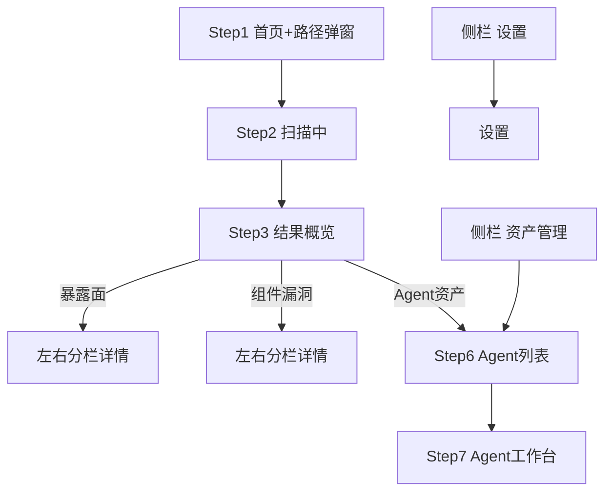

# agentSec macOS 桌面客户端 — UI 设计壳（定稿）

> 暗紫毛玻璃 · 桌面工具密度 · 首页简洁 · 详情左右分栏 · 弹窗仅用于配置/确认。

**状态：定稿。** 后续实现、PRD 和原型均以本文件及同目录 PNG 为准；早期 Web 玻璃拟态稿、侧栏多扫描入口稿、详情弹窗稿不再作为准绳。

## 全局布局

```
┌─────────────┬──────────────────────────────────────┐
│  [Logo]     │  内容区顶边与 Logo 底边对齐            │
│─────────────│                                      │
│ ◉ 安全扫描   │         右侧主体内容区                 │
│ ○ 威胁管理   │                                      │
│ ○ 漏洞管理   │                                      │
│ ○ 资产管理   │                                      │
└─────────────┴──────────────────────────────────────┘
```

| 侧栏 | 职责 |
|------|------|
| **安全扫描** | 发起扫描 + **整机概括**结果页（Step 3） |
| **威胁管理** | 全机威胁事件，左右分栏列表 + 详情（无返回按钮） |
| **漏洞管理** | 全机组件 CVE 表格列表（无返回按钮） |
| **资产管理** | Agent 列表 → 工作台（运维 + Agent 级威胁/漏洞 Tab） |
| **设置** | 语言、主题、扫描、资产管理确认策略 |

**一次扫描引擎**：安全扫描会发现暴露面/基线、组件 CVE、Agent 资产；资产管理复用这些发现结果，并提供管理操作。

**面向用户：** 普通本机用户，不预设其具备安全研究背景。界面文案应少术语、少长句，优先回答「有没有风险」「先看什么」「这个组件是干什么的」。

---

## Step 1 — 安全扫描首页

首页保持简洁，不做控制台堆叠。

| 区域 | 规范 |
|------|------|
| 主标题 | 简短一句话，例如「一键检查 Agent 安全风险」 |
| 范围 | 3 个短标签：基线配置 / 组件漏洞 / Agent 资产识别 |
| 操作 | 开始扫描 + 上次扫描 |

**扫描路径（隐藏式）：**

- 首页仅小链接「扫描路径」
- 点击 → **弹窗**（`step1-scan-path-modal`）：本机全部 / 自定义路径 + 选择文件夹
- 不在首页展开表单

---

## Step 3 — 扫描结果（紧凑卡片 + 待处理动作）

定稿：`step3-results-cards-v3.png`（v2 / 旧版 PNG 仅作历史参考）

结果页采用桌面工具密度，卡片不再做宣传页式大留白。**全机视角**：威胁与漏洞分卡展示，与 Step7 Agent Tab 命名一致。

| 区域 | 内容 |
|------|------|
| **顶栏左上** | **综合安全评分**（环形 gauge + 分数 / 100 + 状态标签：安全/良好/注意/风险）；综合威胁高危/中危/低危与高危 CVE 扣分 |
| 顶栏其余 | 扫描完成 · 耗时 · 路径 · **重新扫描** |

| 卡片 | 关键信息 | 点击 → |
|------|----------|--------|
| **威胁管理** | 高危 / 中危 / 低危 + 共 N 项检查结论 | Step 4a（单 Agent 可直达 Step7 威胁管理） |
| **威胁类别分布** | 仅 `exposure_findings` 按 category 聚合（如 Prompt 注入、权限提升） | 同左，进 Step 4a |
| **Agent 资产** | Agent / MCP / Skills 计数 | Step 6 Agent 列表 |
| **组件漏洞** | 已扫描组件 / 高危 CVE / 中危 CVE / 受影响组件数 | Step 4b（单 Agent 可直达 Step7 漏洞管理） |
| **全机权限雷达** | 各 Agent 权限维度对比 |  informational；可点 Agent 图例进 Step7 概览 |
| **待处理动作** | **分项列出**，不合并威胁与 CVE | 见下表 |

**待处理动作（分项，禁止合并计数）：**

| 条目 | 条件 | 点击 → |
|------|------|--------|
| 威胁高危待处理 | `exposure` 高危 > 0 | Step 4a |
| 组件漏洞待处理 | 受影响组件 > 0 或 CVE 高危 > 0 | Step 4b |
| 组件可更新 | updatable 资产 > 0 | Step7 资产管理 |
| Skill / MCP 已禁用 | 对应禁用数 > 0 | Step7 资产管理 |

顶栏：扫描完成 · 耗时 · 路径 · **重新扫描**

**注意：** Step 3 只做概览与入口，不承载完整列表；完整列表和明细均进入 Step 4 左右分栏。

---

## Step 4 — 详情页（左右分栏）

问题详情和 CVE 详情不再用弹窗承载，改为桌面工具常见的左右分栏。

| 页面 | 左侧 | 右侧 |
|------|------|------|
| **威胁管理**（Step 4a，全机） | 威胁事件列表（每屏 7–10 行） | 选中事件详情、影响说明、证据、建议 |
| **组件漏洞** | 组件表（组件名 / 风险 / CVE 数） | 选中组件 CVE 明细、版本、升级建议 |

弹窗仅用于：扫描路径、更新确认、禁用确认、卸载确认、**权限详情**（Step7 概览雷达入口）。

**不再使用：** 问题详情弹窗、CVE 详情弹窗、结果卡片多级折叠。详情信息应直接出现在右侧详情面板中。

---

## 资产管理（Step 6 → Step 7 串联）

```text
侧栏「资产管理」→ Step6 Agent 列表 → 点击 Agent → Step7 Agent 工作台
Step3「Agent 资产」卡 → Step6（仅 1 个 Agent 时可直达 Step7）
```

### Step 6 — Agent 列表（入口页）

| 区域 | 内容 |
|------|------|
| 顶栏摘要 | Agent 数、MCP / Skills 总数 |
| Agent 卡片 | Hermes / OpenClaw：版本、MCP/Skills/可更新数、「进入」 |
| 不做 | 以全量扁平大表作为主界面 |

### Step 7 — Agent 工作台（单 Agent 内完成查看与管理）

顶栏：← 返回 Agent 列表 · Agent 名 · 版本  
Tab：**概览 | 资产管理 | 威胁管理 | 漏洞管理**

| Tab | 内容 |
|-----|------|
| **概览** | **均衡四宫格**：权限雷达、资产构成、风险摘要、可更新项（`step7-agent-overview.png`） |
| **资产管理** | 子 Tab：MCP / Skills / 知识库 / 依赖；左列表 + 右详情 + 更新/禁用/卸载（`step7-agent-mcp-tab.png` 为 MCP 示例子 Tab） |
| **威胁管理** | **仅该 Agent 的安全规则/暴露面事件**（`exposure_findings`）；**无顶部概览 Pill/图表**；左右分栏列表 + 详情（`step7-agent-threat-tab.png`，交互同 Step 4a 但范围限定当前 Agent） |
| **漏洞管理** | **仅该 Agent 的组件 CVE**（`cve_findings`）；**无顶部概览卡**；**全宽表格列表**（`step7-agent-vuln-tab.png`）；行内「查看」可进 CVE 明细（右侧面板或 Step 4b 同构，MVP 可先表格 + 行展开） |

**数据分工（与 Step 3 结果页一致，不在 Agent 内合并计数）：**

| 数据源 | Agent Tab | 全局入口 |
|--------|-----------|----------|
| 暴露面 / 基线 / 安全规则 | **威胁管理** | Step 3 威胁管理卡 → Step 4a |
| 组件开源 CVE | **漏洞管理** | Step 3 组件漏洞卡 → Step 4b |

概览 Tab 的「风险摘要」可分别跳转 **威胁管理** / **漏洞管理**，但不在两个 Tab 内重复放概览 Pill。

**不必经首页** 才能看 Agent 权限分布；雷达图在 Step7「概览」Tab 四宫格之一，与其他模块权重相当。

### 权限详情弹窗（概览内，非独立页 / 非 Tab）

文件：`step7-permission-modal.png`（**叠在同一 Step7 概览帧上**，背景四宫格压暗，侧栏/Tab/顶栏与 `step7-agent-overview.png` 一致）

权限来自 **Agent 配置、MCP、Skill、知识库** 等多处；**不**跳 MCP Tab，也不占概览版面。

| 入口 | 雷达图区域右下角 **极小半透明图标**（或点击雷达图本身）；无文字、非按钮样式、不占额外布局空间 |
| 弹窗 | 居中毛玻璃面板，标题「权限详情」+ 关闭；与概览卡片 **同色系、同圆角、同密度**；按来源分组的权限行 + 风险 pill |
| 卡片操作 | **定位来源** → 关闭弹窗并切到对应 Tab 选中项（非固定进 MCP） |

**禁止：** Web 管理台侧栏、面包屑、健康分/环形图等与桌面壳不一致的元素。弹窗只是概览上的 overlay，不换页面骨架。

### 威胁管理（Step7 Tab）

文件：`step7-agent-threat-tab.png`

| 区域 | 内容 |
|------|------|
| **不做** | 顶部高/中/低/安全 Pill、环形图、暴露面概览盾牌卡（与 Step 4a 列表重复且口径易混淆） |
| 左栏 | 标题「威胁事件 (N)」+ 严重程度筛选；该 Agent 的 `exposure_findings` 列表（严重度 pill + 标题 + 类别） |
| 右栏 | 选中事件详情：影响、证据、推荐操作、通俗说明（字段同 Step 4a） |
| 范围 | 只展示 `agent_ids` 含当前 Agent 的项；不含 CVE |

### 漏洞管理（Step7 Tab）

文件：`step7-agent-vuln-tab.png`

| 区域 | 内容 |
|------|------|
| **不做** | 顶部 CVE 统计 Pill、右侧常驻详情面板（MVP 以列表为主） |
| 主区 | 全宽表格：组件名称 / 风险等级 / CVE 数 / 当前版本 / 建议版本 / 操作 |
| 工具栏 | 搜索组件名、风险筛选 |
| 范围 | 只展示 `agent_ids` 含当前 Agent 的 `cve_findings` |
| 操作 | 「查看」→ 该行 CVE 明细（可后续补右栏，与 Step 4b 同构；MVP 表格即可） |

### MCP / Skill 详情（Step7 · 资产管理子 Tab 右侧面板）

| 类型 | 详情重点 |
|------|----------|
| **MCP** | 能力、权限范围、配置来源、版本、是否可更新 |
| **Skill** | 一句话用途、来源、触发场景、权限 |

---

## 流程


